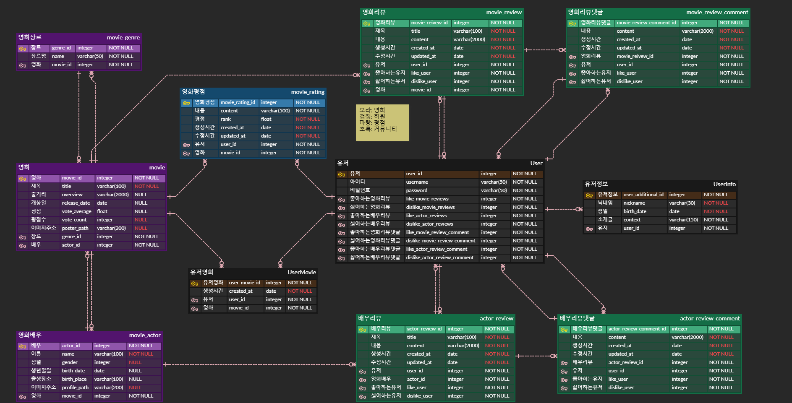
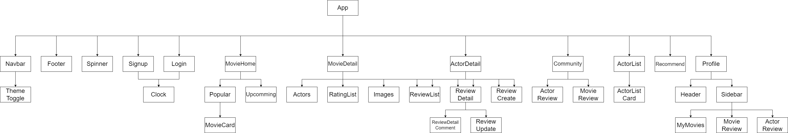
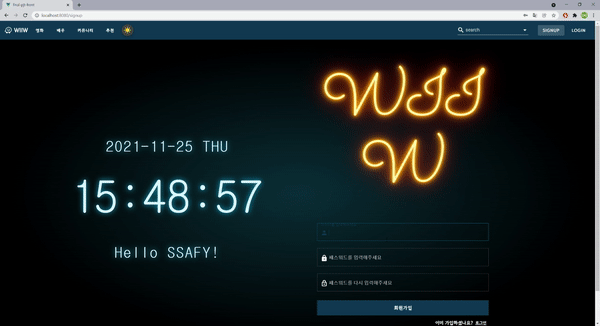
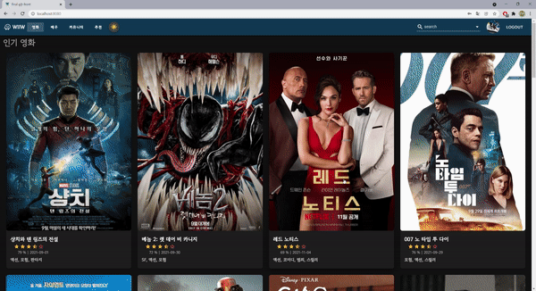
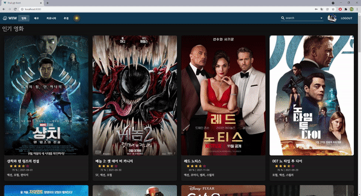
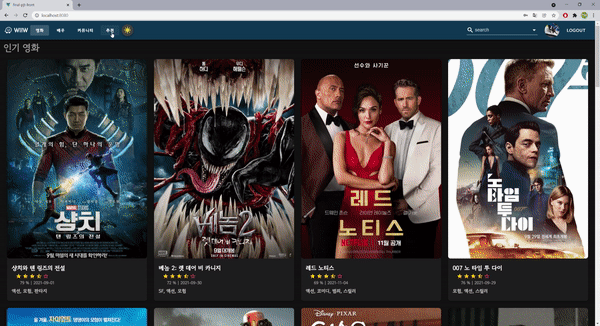
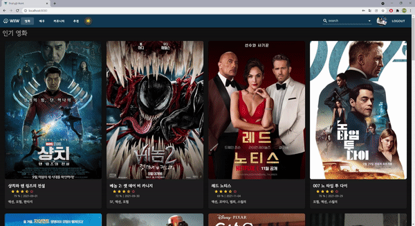

# WIW(영화 추천 웹 사이트)

[TOC]

## 1. 개요

### 🔍 목표

- **한 줄 정리**: 유저가 영화 정보를 보고 의견을 남길 수 있는 웹 페이지 제작
  1. 입력한 평점을 기반으로 추천을 받을 수 있는 서비스
  
  2. 찜하기 기능을 통해 자신의 페이지에서 확인 할 수 있는 서비스
  3. 인기 영화, 인기 배우를 조회할 수 있는 서비스

### 🔨 기술 스택

| 영역          | 스택                                                         |
| ------------- | ------------------------------------------------------------ |
| **Front-End** |      |
| **Back-End**  |   |

## 2. 구성도

### 🗜 ERD

### ⛓ Vue Component

## 3. 주요 기능

<h4 style="text-align: center">로그인 및 회원가입</h4>

<h4 style="text-align: center">인기 영화 및 영화 디테일</h4>

<h4 style="text-align: center">인기 배우 및 배우 디테일</h4>

<h4 style="text-align: center">추천 페이지</h4>

<h4 style="text-align: center">마이페이지</h4>

## 4. 개발 기간 & 역할

`개발 기간`: 2021. 11. 17 ~ 2021. 11. 25 (9일)

`개발 팀원`

| 유동완     | https://github.com/Yookaser      |
| ---------- | -------------------------------- |
| **이상훈** | **https://github.com/sahngrhee** |

`팀원 역할`

|  이름  |               역할                |                             내용                             |
| :----: | :-------------------------------: | :----------------------------------------------------------: |
| 유동완 | 기획 Front-end Back-end | ERD 작성 TMDB API 요청 및 응답 처리 Django DRF 개발 영화 페이지 개발 마이 페이지 개발 추천 알고리즘 개발 추천 페이지 개발 |
| 이상훈 | 기획 Front-end Back-end | Vue 컴포넌트 구조 작성 MVP 기획 로그인 & 회원가입 페이지 및 기능 개발 배우 페이지 개발 다크모드 및 스피너 개발 Alert 커스터마이징 |

## 5. 차후 개선 사항

- 데이터 추가 로직
  - API로 요청을 받았을 때, 없는 영화 및 배우라면 DB에 자동으로 추가하는 로직 구현

- 추천 시스템 세분화
  - 장르별, 기간별 등 유저의 커스텀에 따라 알맞은 추천 로직 구현

- 영화 예매 사이트 연계
  - 유저가 원하는 영화가 있다면 해당 영화의 예매 페이지로 이동할 수 있는 버튼 구현

- 소셜 로그인
  - 네이버, 구글, 카카오 등 유저가 자주 사용하는 플랫폼과의 로그인 연계 추가

- 알림 기능
  - 유저가 추천, 비추천, 찜하기 등의 기능을 수행했을 때 알림을 받을 수 있게 구현

- 부가적인 편의 기능
  - 리뷰 작성 시 스포 여부, Navbar 생략 등

## 6. 느낀점

며칠을 온전히 집중해서 개발을 한 첫 프로젝트였습니다. 영화 추천 사이트라는 명확한 주제가 있었지만, 그 이상은 자유였습니다. 매주 진행한 프로젝트에서 없던 자유라는 것이 큰 부담감으로 다가왔지만, 목표 이상을 이루고 싶다는 욕심도 있었습니다.

더 많은 시간을 투자하게 만들어준 것이 욕심이었지만, 한편으로는 독이되었습니다. 더 많은 기능을 구현하고 싶은 욕심이 복잡한 모델 및 컴포넌트를 기획하게 만들었습니다. 명세된 기능만 구현하기에도 시간이 부족했기에, 부가적인 요소들을 많이 고려하지 못했습니다. 프로젝트 중반 즈음이 되어서야 "이 보노보노한 사이트를 누가 쓰지?"라는 생각을 하게 되었고, 그때서야 기능들을 많이 포기하고 디자인에 시간을 쏟았습니다.

여러 애니메이션, 색상, 글꼴 등 codepen 같은 사이트를 참고하며 이쁘게 꾸민다고 노력했지만, 다시 한 번 결과물을 볼 때 난잡하게 느껴졌습니다. 다시 한 번 "이 덜 보노보노한 사이트를 누가 쓰지?"라는 생각을 하게 되었습니다. 결국 기획할 때 "컨셉이 무엇인가?", "핵심 색상은 무엇인가?", "사이트가 고객을 불러올 핵심 요소가 무엇인가?" 등의 질문에 답하지 않았기 때문이었습니다. 첫 술에 배부를 수 없듯, 많은 아쉬움이 남았지만 많은 것을 배울 수 있었습니다.

1. 명확한 기획이 우선되어야 한다.
   - 알고리즘 문제를 보면 손푸터 나가는 습관을 고치고자 노력했습니다. 이런 습관이 결국 더 많은 시간을 낭비하게 되고, 문제를 풀지 못할 수도 있다는 것을 직접 느끼면서 알게 되었습니다. 개발에 있어서도 이번 프로젝트가 그런 경험을 할 수 있게 만들어 주었습니다.

2. 응용할 줄 아는 개발자가 되어야 한다.
   - 약 9일이라는 짧은 시간 동안 프로젝트를 하면서 모든 것을 직접 구현할 수는 없었습니다. 간단한 버튼부터 화면의 레이아웃까지 다른 사람들의 결과물을 참고해야 했습니다. 여러 사이트에는 정말 다양하고 이쁜 것들이 많았습니다. 하지만 svg, scss, jquery 등 배우지 못했던 언어들로 만들어졌기에 가져와서 실행해도 오류가 나는 경우가 많았습니다.  어떻게 작동하는지 느낌적으로는 알 수 있었지만, 이런 오류들을 해결하지는 못했습니다. 이런 오류들을 해결하고 자신의 개발에 응용할 수 있다면 정말 생산성이 높아지겠다는 느낌을 많이 받을 수 있었습니다.
